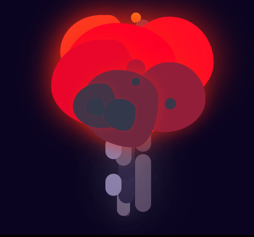
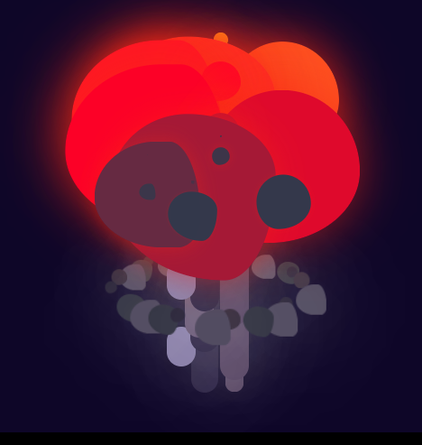

# CSS-To-The-Rescue

I will be making a an atomic explosion...

## Week 1

In the first week we were able to choose our theme's. I had many idea's for 3 of the themes, but then I came up with the idea of creating a nuclear explosion in CSS with the fireworks theme. After I got approval of Sanne to do it, I started thinking about what I am gonna create.

### First thoughts

So obviously I need SOME sort of particle emmitter style setup to create this. I can't literally make a particle emitter which is randomized, but I should be able to make something that LOOKS randomized. Since you can infinitely loop animations in CSS, I can contiously 'spawn' elements. So I definitely have to think about that. I also want the user to be able to slightly customize the explosion by being able to choose to add a shockwave, radiation cloud and initial flash. I specifically want the user to be able to turn that off or on because if anyone with epilepsy stumbles across this project, I don't think they'd appreciate the bright lights...

I initially wanted to add a sound for when the shockwave reaches you, but I'm not sure if it's possible? But as I'm writing this I thought of an idea: is it possible to create an audio tag which when you press the button starts the audio. The audio however is around 30 seconds of silence but at the end has a shockwave sound. In my head this sorta makes sense but I'd have to test this out. In any case, you are also able to select the distance and depending on where you are, the shockwave will reach you faster or slower. If I have extra time I might want to add a close-up slowmotion option which would show the <a href="https://www.youtube.com/watch?v=A9S3MUxH680">rope trick effect</a>. Honestly I think it looks insane and would love to recreate this in CSS, but I think this could even be a project of it's own so for now it's in the backburner...

I also want to add atomic goggles which you HAVE to wear because it will render you blind otherwise. As a safety, if you have flashing lights turned off, you won't be able to press the button at all. If you have flashing lights turn on you will be able to press the button to which you will only see a bright flash. Now that I'm typing this I am doubting how I am supposed to do this system without JavaScript, but I'll have to think about that or think of something else.

### Features and sketch

The features I want to add are:

-   Light / Dark mode (daytime or nighttime)
-   Shockwave / radiation cloud / initial flash toggle
-   Distance selector
-   Atomic goggles
-   Choose color of nuke? Maybe a fun option to add


Above is my first sketch I made and I tried to explain which part should be what element. I might have to change the button for an audio tag instead. Or atleast let the audio tag play somehow if it's checked? I need to know if this is possible!

## Week 2

### Struggling

So I started initially by making the control panel. I just used a form and some fieldset to create a rough control panel where I can detonate my bomb. Then, I created a very simple animation of the initial blast. It was basically a simple animation of a circle expanding very quickly. I used a radial gradient to create a motion blur effect and it looked pretty nice. Using `:has()` I was able to link the detonate button with the explosion so that the button triggers the blast.

So that's where it ended for day one.. And day 2 mostly. In day 2 I really wanted to start with the actual mushroom cloud but I couldn't get started. I had already attended the randomness workshop but I didn't feel like I could add it to my project. I tried to make a simple animation of a single fireball increasing in size and then decreasing while going down, but I just couldn't make it smooth. In After Effects I can do this in 3 seconds with a blindfold, but in CSS I was just struggling. I couldn't work out how to actually make it smooth in CSS since keyframes work just slightly different in CSS, but it's significant enough that I couldn't make it work. When I tried to change the size while the position was going down somehow It cancelled out the position keyframes which just made me MAD. I had to add every keyframe individually, but then the keyframes would add easing to each keyframe. I tried making it smooth using `cubic-bezier` but that was just more frustration. It's nearly impossible to smoothly transition between keyframes using `cubic-bezier`. I was extremely frustrated so I went home early since I couldn't get anything done.

When I got home, I finally made progress...

### I am become death...

So when I got home, after a small break I looked up HOW to keyframe two properties (position and scale) and make it make smooth. Turns out, just use two animations...... Literally make one animation move it down, and use the other to scale it. That's it. Well now that I had a smooth animation, I could add more smoke and fire! I just made a bunch of div's and then individually changed the width/height and position. This made it look very random. I used the same technique for the 'shaft'. At this point the nuke started forming:


It's still a bit messy and the way I randomized the blobs is not very good, so there's still some cleaning up but it's definitely taking shape! Here is the code by the way:

```css
/* general blobs */
article:nth-of-type(2) div {
    position: absolute;
    scale: 0;

    animation: down 3s ease-in-out infinite, scale 3s ease-in-out infinite;
}

/* blobs 1-5 */
article:nth-of-type(2) div:nth-of-type(1) {
    width: 5em;
    height: 5em;
    left: 10%;

    border-radius: 67% 34% 25% 74% / 60% 82% 31% 54%;
}

article:nth-of-type(2) div:nth-of-type(2) {
    width: 8em;
    height: 8em;
    left: 20%;

    border-radius: 67% 34% 25% 74% / 60% 82% 31% 54%;

    animation-delay: 1.9s;
}

article:nth-of-type(2) div:nth-child(3) {
    width: 12em;
    height: 12em;
    left: 20%;

    border-radius: 67% 34% 25% 74% / 60% 82% 31% 54%;

    animation-delay: 1.4s;
}

article:nth-of-type(2) div:nth-child(4) {
    width: 10em;
    height: 10em;
    left: 50%;

    border-radius: 67% 34% 25% 74% / 60% 82% 31% 54%;

    animation-delay: 0.3s;
}

article:nth-of-type(2) div:nth-child(5) {
    width: 9em;
    height: 9em;
    left: 25%;

    border-radius: 67% 34% 25% 74% / 60% 82% 31% 54%;

    animation-delay: 0.5s;
}

/* blobs 6-10 */
article:nth-of-type(2) div:nth-child(6) {
    width: 7em;
    height: 7em;
    left: 40%;

    border-radius: 67% 34% 25% 74% / 60% 82% 31% 54%;

    animation-delay: 1.3s;
}

article:nth-of-type(2) div:nth-child(7) {
    width: 5em;
    height: 5em;
    left: 60%;

    border-radius: 67% 34% 25% 74% / 60% 82% 31% 54%;

    animation-delay: 1s;
}

article:nth-of-type(2) div:nth-child(8) {
    width: 6em;
    height: 6em;
    left: 30%;

    border-radius: 67% 34% 25% 74% / 60% 82% 31% 54%;

    animation-delay: -0.5s;
}

article:nth-of-type(2) div:nth-child(9) {
    width: 8em;
    height: 8em;
    left: 10%;

    border-radius: 67% 34% 25% 74% / 60% 82% 31% 54%;

    animation-delay: -0.2s;
    /* outline: solid 1em; */
}

article:nth-of-type(2) div:nth-child(10) {
    width: 6em;
    height: 6em;
    left: 60%;

    border-radius: 67% 34% 25% 74% / 60% 82% 31% 54%;

    animation-delay: -0.7s;
}
```

...So yeah, literally individually changing each div. I will change this and make this MUCH cleaner using probably the randomization technique which I learned from Nils Binder.

I have also found this website which has some useful particle effects I might use: https://csscrafter.com/css-particle-effects/

## Week 3

### Better animation setup

So far I have a rough nuke animation which is nice, but I would like to add more detail and make it more pronounced. One of the first things I did was use a technique where I could add a delay to each of the blobs instead of adding each delay manually. It is a bit complicated, but it looks something like this:

```css
/* declare number and animation length */
:root {
    --n: 30;
    --animation-length: 4s;
}

/* give index to each and every child */
:nth-of-type(1) {
    --i: 1;
}
:nth-of-type(2) {
    --i: 2;
}
:nth-of-type(3) {
    --i: 3;
}
:nth-of-type(4) {
    --i: 4;
}
:nth-of-type(5) {
    --i: 5;
}

/* etc., etc... */
```

So with this setup, I can select every child of something and give it an index. In the root I declare a variable which has the total amount of selected children. I will use these selectors later to add a delay to the animation:

```css
div {
    animation: mushcloud var(--animation-length) calc(var(--animation-length) * -1 / var(--n) * var(--i)) ease-in-out infinite;
}
```

So I'm not gonna lie and say that I'm not entirely sure how this formula works, but the important thing is that using this method I can add a set delay to which each child element will do one after the other. So instead of setting a delay for each element like: .2s, .4s, .6s, .8s etc. I can just say I want the delay to be .2s and have them do the animation one after the other.

With this technique I was able to create the mushroom cloud effect in a much better way. Not only is it cleaner to do it like this, I can also now re-use these `--i` and `--n` variables in other animations, like the shaft rise animation.

I can definitely thank Sanne for teaching me this technique because it is extremely useful and I will most likely keep using this in future projects.

### Randomization

I attended a workshop last week with Nils Binder which was about randomization. I wasn't able to apply this technique to my project yet, because I didn't know if it was possible to do this with position. So it turns out it is, I just had to think a bit more clever about it:

```css
div {
    position: absolute;
    scale: 0;
    width: calc(3.5em * var(--v3) * var(--v1));
    aspect-ratio: 1;
    border-radius: var(--br);
    left: calc(30% * var(--v1) * var(--v2));

    animation: mushcloud var(--animation-length) calc(var(--animation-length) * -1 / var(--n) * var(--i)) ease-in-out infinite;
}

div:nth-of-type(2n) {
    --v1: 1.8;
    --v2: 0.5;
    --v3: 1.6;
    --br: 47% 53% 31% 69% / 45% 37% 63% 55%;
}

div:nth-of-type(3n) {
    --v1: 1.25;
    --v2: 0.43;
    --v3: 1.87;
    --br: 67% 34% 25% 74% / 60% 82% 31% 54%;
}

div:nth-of-type(5n) {
    --v1: 1.35;
    --v2: 1.41;
    --v3: 0.42;
    --br: 49% 51% 60% 40% / 50% 53% 47% 50%;
}

div:nth-of-type(7n) {
    --v1: 1.75;
    --v2: 1.21;
    --v3: 1.32;
    --br: 49% 51% 60% 40% / 50% 53% 47% 50%;
}
```

So, what's happening here is that I use a bunch of selector to which I add a bunch of variables with each different numbers. Then, using `left` on the general div I can add a `calc()` to multiply or divide these different variables with each other. I also do this for the width and border radius. The randomness in combination with the delay technique results in an animation which looks really randomized and organic.



### Form styling

I wanted to add some styling to the buttons in the form to make it look more like a control panel. I wanted to do this to obviously make this a bit more immersive. The main thing I wanted to do is make some 'realistic' buttons that you can push. This is how I did it:

```css
/* button styling */
fieldset:nth-of-type(-n + 2) label::before {
    content: '';
    position: absolute;
    top: 0;
    left: 0;
    right: 0;
    height: 5em;
    border-radius: 100%;
    /* outline: solid 1em blue; */

    background-color: var(--btn-top, #ee2a94);
    box-shadow: inset 0 -0.7em 0 var(--btn-top-highlight, #fc71c4), inset 0 0.7em 0 var(--btn-top-shadow, #d0248c);
}

fieldset:nth-of-type(-n + 2) label::after {
    content: '';
    position: absolute;
    bottom: 0;
    display: block;
    width: 100%;
    height: 5em;
    border-radius: 0 0 50% 50%;
    background-color: var(--btn-bottom, #a81665);

    box-shadow: inset -0.4em -0.4em 0 var(--btn-bottom-darkshadow, #370624), inset -3em 0 0 var(--btn-bottom-shadow, #711641), 0 0.5em 0 var(--btn-bottom-darkshadow, #370624);

    z-index: -1;
}
```

Because I wanted a 3D look, I used a `::before` and an `::after`. Using a bunch of box-shadows I was able to mimick a semi 3D style. I added a simple hover and checked state which makes it looks like the button is actually being pressed.

I wanted the 3 buttons on the left to each do something. One will add a flash, the second will add clouds and the third will activate rainbow mode. But I only want it to apply it to the nuke when the detonator button is pressed. I couldn't figure out how to do it, but it turns out that it's pretty simple:

```css
/* initial flash */
body:has(fieldset:nth-of-type(2) input:checked):has(fieldset:nth-of-type(1) label:nth-of-type(1) input:checked) article:nth-of-type(1) div:nth-of-type(2) {
    animation: blast 3s;
}
```

It's a very long selector, but the important part is that I use 2 `:has()` selectors. In simple terms, I'm basically saying: if the detonator has an input:check AND the one of the control buttons has input:check, add the animation. It's a very easy solution and works like a charm.

After that I wanted to make sure you aren't able to press any of the button while the nuke is being set off, so I used this simple code to do that:

```css
/* if kaboom button is pressed, you can't press any other buttons */
body:has(fieldset:nth-of-type(2) input:checked) fieldset:not(:nth-of-type(2)) {
    pointer-events: none;
}
```

### Things left to do:

-   Distance slider fix (container around nuke)
-   Add smoke ring
-   Add shockwave sound
-   Background scenery change (?)
-   Animate background color

## Week 4

### Smoke ring
The final thing I wanted to add to the nuke was a smoke ring. I wanted to do this so that I could use some 3D stuff for the first time in css. 

```css
@keyframes smoke-ring {
    0% {
        transform: rotateY(0turn) translateZ(6.5em) rotateY(0turn);
    }

    100% {
        transform: rotateY(1turn) translateZ(6.5em) rotateY(-1turn);
    }
}
```

```css
article {
    --smoke-anim-length: 10s;
    transform-style: preserve-3d;
    perspective: 30em;
    position: absolute;

    background-color: #fff2;
    left: 70%;

    span {
        position: absolute;
        width: calc(3em * var(--v1) * var(--v2) / var(--v3));
        top: 9em;
        aspect-ratio: 1;
        background-color: rgb(57, 63, 82);
        box-shadow: 0 0 5em #fff5;
        border-radius: var(--br);
        animation: smoke-ring var(--smoke-anim-length) calc(var(--smoke-anim-length) * -1 / var(--n) * var(--i)) linear infinite;
    }
}
```

I again used the same technique as the other smoke elements to create this last ring. The only difference is that the animation is 3D. I had to shuffle around some elements in HTML to get this effect working properly, because the smoke ring itself was 3D, but it wouldn't go around the shaft. Instead it'd just stay in front of it. This is because it wasn't a child element of the shaft. So moving the smoke ring inside the shaft did the trick and now the animation is 'truly' 3D.

Source: https://codepen.io/shooft/pen/PogNKdx



### Title animation
One of the final things I needed to add was a title. Since I forgot to add this in the first place, I didn't have a good place for my title. So I decided to make an intro title animation.

I wanted to control each letter individually, so in HTML I had to create a h1 with a span for each letter inside. This way I'm able to control each letter without affecting the others. So the way I'm animating the intro is by chaining 3 animations, the intro text, the text going away and then the fade-out:

```css
@keyframes intro {
    0% {
        visibility: visible;
        color: yellow;
        gap: 0;
    }

    100% {
        opacity: 1;
        gap: .5em;
        color: red;
    }
}

@keyframes text-splode {
    0% {
        filter: blur(0);
    }

    100% {
        filter: blur(2em);
        transform: translateY(-10em);
        opacity: 0;
        visibility: hidden;
    }
}

@keyframes fade-away {
    0% {
        opacity: 1;
    }

    99% {
        opacity: 0;
        scale: 1;
    }

    100% {
        opacity: 0;
        scale: 0;
    }
}
```

To make sure the title animation is gone I scale the entire div down to 0. For some reason using ```display: none;``` does not work.

```css
body > div:first-of-type {
    --title-anim-length: 3s;
    position: absolute;
    top: 0;
    bottom: 0;
    left: 0;
    right: 0;
    background-color: rgb(43, 6, 6);
    z-index: 2;

    animation: fade-away 3s var(--title-anim-length) ease-in-out both;

    h1 {
        font-family: 'Bowlby One', sans-serif;
        display: flex;
        justify-content: center;
        position: absolute;
        color: white;
        width: 100%;
        text-align: center;
        top: 30%;
        font-size: 6vw;
        text-transform: uppercase;
        text-shadow: 0.1em 0.1em 0 black;

        animation: intro var(--title-anim-length) both;
        opacity: 0;

        span:nth-of-type(1) {
            animation: text-splode 3s calc(var(--title-anim-length) + 0.2s) ease-in-out both;
        }

        span:nth-of-type(2) {
            animation: text-splode 3s calc(var(--title-anim-length) + 1s) ease-in-out both;
        }

        span:nth-of-type(3) {
            animation: text-splode 3s calc(var(--title-anim-length) + 0.4s) ease-in-out both;
        }

        span:nth-of-type(4) {
            animation: text-splode 3s calc(var(--title-anim-length) + 0.8s) ease-in-out both;
        }

        span:nth-of-type(6) {
            animation: text-splode 3s calc(var(--title-anim-length) + 0.9s) ease-in-out both;
        }

        span:nth-of-type(7) {
            animation: text-splode 3s calc(var(--title-anim-length) + 0.2s) ease-in-out both;
        }

        span:nth-of-type(8) {
            animation: text-splode 3s calc(var(--title-anim-length) + 0.4s) ease-in-out both;
        }

        span:nth-of-type(9) {
            animation: text-splode 3s calc(var(--title-anim-length) + 0.1s) ease-in-out both;
        }
    }
}
```